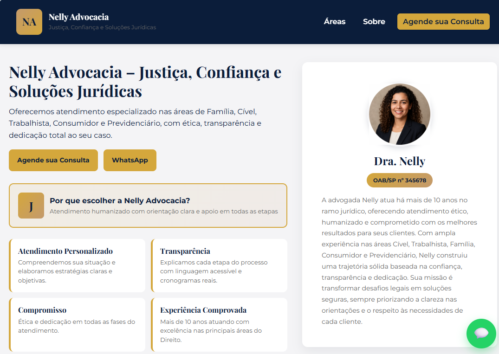
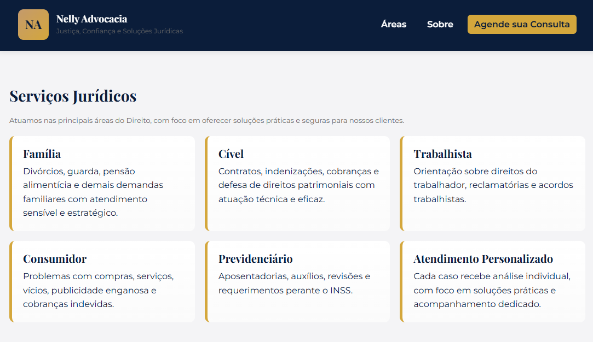

# Nelly Advocacia - Website

## 📋 Sobre o Projeto

Website profissional para o escritório **Nelly Advocacia**, desenvolvido com foco em apresentar os serviços jurídicos oferecidos, criar confiança com potenciais clientes e facilitar o contato através de múltiplos canais.

O site apresenta uma interface moderna, responsiva e otimizada para conversão, destacando as áreas de atuação, depoimentos de clientes e informações de contato.

 
 


## ✨ Características

- **Design Responsivo**: Adaptado para desktop, tablet e mobile
- **Menu Hamburguer**: Navegação otimizada para dispositivos móveis
- **Botão WhatsApp Flutuante**: Acesso rápido ao atendimento
- **Formulário de Contato**: Captura de leads integrado
- **Seção de Testemunhos**: Depoimentos reais de clientes
- **Mapa Integrado**: Localização do escritório via Google Maps
- **Smooth Scroll**: Navegação suave entre seções
- **Paleta de Cores Profissional**: Visual elegante e confiável

## 🎨 Paleta de Cores

- **Azul Escuro** (`#0B1D3A`): Cor principal - transmite confiança e profissionalismo
- **Dourado Mostarda** (`#D4A73C`): Cor de destaque - sofisticação e excelência
- **Coco** (`#C49A6C`): Cor secundária - elegância e acolhimento
- **Branco** (`#ffffff`): Backgrounds limpos
- **Cinza Claro** (`#f4f4f6`): Backgrounds suaves

## 🚀 Tecnologias Utilizadas

- **HTML5**: Estrutura semântica
- **CSS3**: Estilização moderna com CSS Grid e Flexbox
- **JavaScript**: Interatividade e funcionalidades
- **Google Fonts**: Tipografia Montserrat e Playfair Display
- **Google Maps API**: Integração de mapa

## 📁 Estrutura de Arquivos

```
nelly-advocacia/
│
├── index.html          # Página principal
├── styles.css          # Estilos CSS
├── script.js           # JavaScript
├── README.md           # Documentação
│
├── img/                # Imagens do site
│   ├── advogada.png
│   ├── Carlos-Silva.png
│   ├── Ana-Paula-Costa.png
│   └── Roberto-Mendes.png
│
└── src/                # Imagens da documentação
    ├── readme1.png
    └── readme2.png
```

## 📱 Seções do Site

### 1. Header (Cabeçalho)

- Logo e identidade visual
- Menu de navegação
- Botão de CTA "Agende sua Consulta"
- Menu hamburguer responsivo

### 2. Hero (Seção Principal)

- Proposta de valor clara
- Botões de ação (Contato e WhatsApp)
- Cards de diferenciais
- Foto e informações da advogada

### 3. Áreas de Atuação

- **Família**: Divórcios, guarda, pensão alimentícia
- **Cível**: Contratos, indenizações, cobranças
- **Trabalhista**: Direitos do trabalhador, reclamatórias
- **Consumidor**: Problemas com compras e serviços
- **Previdenciário**: Aposentadorias, auxílios, revisões

### 4. Testemunhos

- Depoimentos de 3 clientes reais
- Sistema de avaliação por estrelas
- Fotos dos clientes

### 5. Contato

- Formulário de contato completo
- Informações de localização
- Horário de atendimento
- Links para WhatsApp

### 6. Footer (Rodapé)

- Informações do escritório
- Dados de contato
- Mapa integrado do Google Maps
- Copyright


## 🔧 Como Usar

1. **Clone ou baixe o projeto**

```bash
git clone https://github.com/seu-usuario/nelly-advocacia.git
```

2. **Abra o arquivo `index.html` no navegador**

   - Não requer servidor local
   - Funciona diretamente no navegador

3. **Personalize as informações**
   - Edite o arquivo `index.html` para alterar textos
   - Modifique `styles.css` para ajustar cores e espaçamentos
   - Atualize as imagens na pasta `img/`

## 📞 Informações de Contato (Exemplo)

- **Telefone/WhatsApp**: (15) 99134-5227
- **Email**: advocacia@nelly.com
- **Endereço**: Rua Exemplo, 123 — Centro, Cidade/UF
- **Horário**: Segunda a Sexta — 9h às 18h

## 🎯 Funcionalidades JavaScript

- **Menu Hamburguer**: Toggle de abertura/fechamento
- **Navegação Suave**: Scroll animado entre seções
- **Formulário de Contato**: Captura e validação de dados
- **Fechamento Automático**: Menu fecha ao clicar em links

## 📝 Customização

### Alterar Cores

Edite as variáveis CSS no arquivo `styles.css`:

```css
:root {
  --blue-dark: #0b1d3a;
  --mustard: #d4a73c;
  --coco: #c49a6c;
}
```

### Modificar Conteúdo

Todos os textos estão no arquivo `index.html` e podem ser editados diretamente.

### Adicionar Novas Seções

Use a estrutura de cards existente como template:

```html
<section>
  <h3>Título da Seção</h3>
  <div class="card">
    <!-- Seu conteúdo aqui -->
  </div>
</section>
```

## 🌐 Responsividade

O site é totalmente responsivo com breakpoints em:

- **Mobile**: até 600px
- **Tablet**: 601px a 900px
- **Desktop**: acima de 900px

## 📄 Licença

Este projeto foi desenvolvido para uso do escritório Nelly Advocacia.

## 👨‍💻 Suporte

Para dúvidas ou suporte técnico, entre em contato através do formulário no site ou pelo WhatsApp.

---

**© 2025 Nelly Advocacia. Todos os direitos reservados.**
